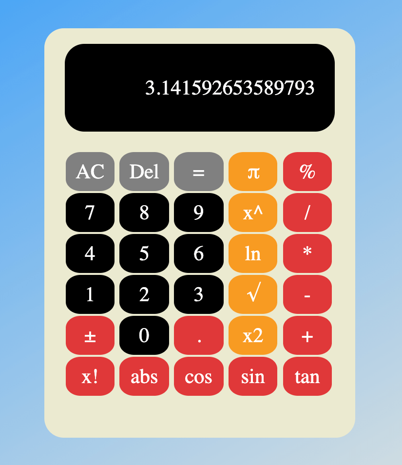
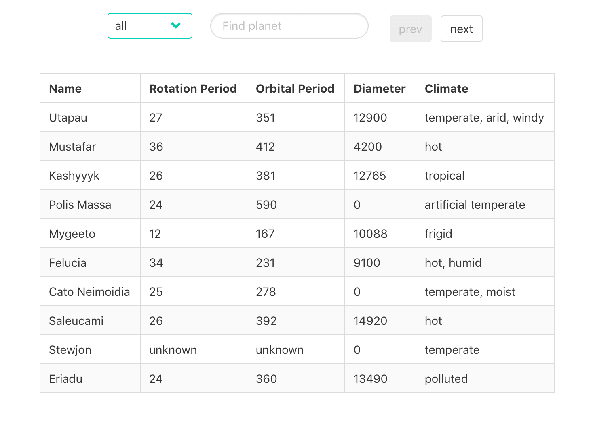

# devc-basic-js
Learn more about basic html, css and js with expert on devc community Jakarta.

## Exercise 1: Introduce html and css
[](https://vendywira.github.io/devc-basic-js/src/exercise-1-introduce-html-css/)

## Exercise 2: Basic js and DOM manipulation
[](https://vendywira.github.io/devc-basic-js/src/exercise-2-basic-js-and-dom-manipulation/)

## Exercise 3: Basic Logic JS
###### click image to preview this exercise
[](https://vendywira.github.io/devc-basic-js/src/exercise-3-javascript-and-basic-logic/)

## Sass what is this??
when stylesheets are getting larger, more complex,
 and harder to maintain. we need sass for this condition. 
What is Sass? Sass is preprocessor which will help you to maintenance your css. we can use function, inheritance and
 operator like programming language.
 for implement sass on our project, we should be install node js and sass.
And then type command like bellow to auto compile scss to css when any changes.
```sass
sass --watch style.scss style.css
```

for more detail about sass you can read their documentation at [sass guideline](https://sass-lang.com/guide)

## BEM (Block Element Modifiers)
Convention for class naming on css to readable. For more detail you can read on [bem official website](http://getbem.com/introduction/)

## Basic DOM 
on exercise 2 we learn about basic js and how DOM work. we can use dom to manipulating view on html.

```javascript
const scientific = document.querySelector('.scientific')
const screen = document.querySelector('.calculator__display')
...

// we can also give action when user interact with dom like bellow

scientific.addEventListener('click', e => {
  if (e.target.classList.contains('button')) {
    const key = e.target
    const action = key.getAttribute('action');

    if (!action) {
      typeNumber()
    }

    if (action) {
      actions(action)
    }
  }
})
```
## Component Base
on exercise 3, I learn about function, class and object. also i read some literation about component base and how implement best practice on js. on all literation almost used on modern framework like react, vue or angular. but i think i can implement also on vanilla js. there are some problem when i try to implement. such as the component should be independent not depend to other, first problem i found about how to communicate between components?
ok i have solution to provide each components their own data and i will pass that data when communicate. but we must be remember, component is independent to other.
i try to solve this problem with create center global data to store shared data. but blowup other problem, the component not only communicate with data, but also necessery action like loading and etc. therefor we need provide central action abstraction for component which one need call action other action. but for present, still try to implement central action and not yet going done.
